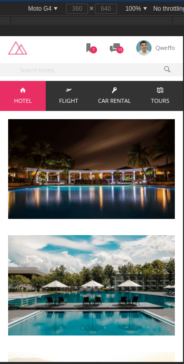
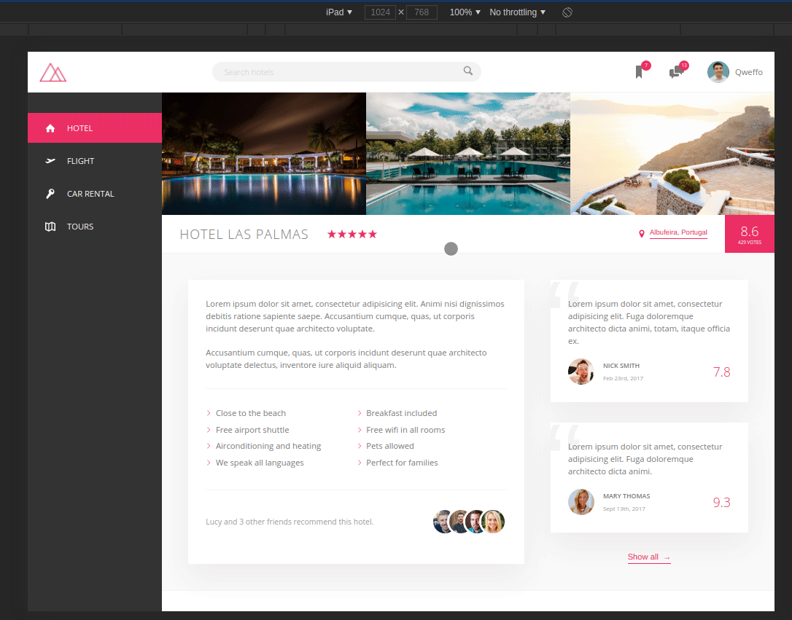

# Trillo Project

### I did this project to improve my domain on flexbox and learn some new CSS and SASS tricks, the reason why I focused on CSS is that I saw that many programmers and myself consider it to be one of the most difficult frontend activities

### I let below some gifs to show the functionality, but if you want to run this project on your pc the only thing you have to do is download the repo and open the index.html in your browser, it it's prepared to run in all browsers

